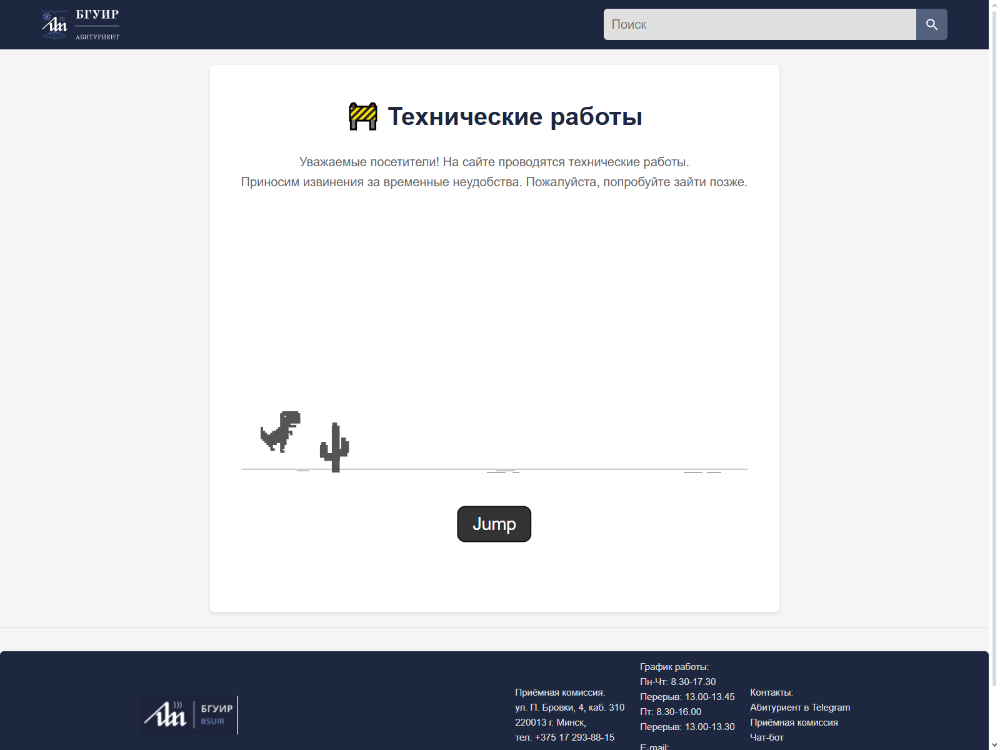

# 🚧 Страница технических работ

Этот проект – демонстрация того, как можно создать анимированный интерфейс, используя **только HTML и CSS**, без каких-либо JavaScript или иных скриптов. Используя пиксель-арты вместо изображений.

[](https://github.io/boykopovar/DinoTech)

---

## 🔥 Основные особенности

- 🧹 **Простата кода (в каком-то смысле)**:  
  Всё построено на HTML и CSS – никаких JavaScript или дополнительных библиотек.

- 🎞 **Анимации с помощью CSS**:  
  Используются сложные анимации через `@keyframes` для имитации движения динозаврика, прыжков и появления текстовых сообщений.

- 🎨 **Минимализм**:  
  В проекте не используются картинки – за исключением логотипа БГУИР, который загружается по ссылке. Это подчёркивает возможности CSS в создании визуальных эффектов.  
  **Даже динозаврик представляет собой пиксель-арт, прописанный в CSS.**

- 📱 **Адаптивность**:  
  Дизайн корректно отображается на разных устройствах благодаря адаптивной вёрстке и медиа-запросам.

---

## ⚙ Логика работы

- 🏃 **Движение дорожки**:  
  Фоновая дорожка двигается анимацией `shift-track` вместе с кактусами, создавая иллюзию непрерывного бега.

- 🦖 **Бегущий дино**:  
  Динозаврик создаётся с использованием одного элемента, которому задаётся сложное свойство `box-shadow` для формирования его "пиксельного" облика. Анимация `animate-legs` имитирует бег, переключаясь между двумя пиксель-артами, что создаёт эффект движущихся ног.

- 🚀 **Прыжок**:  
  При нажатии кнопки "Jump" запускается анимация `leap-motion`, которая поднимает персонажа вверх. Однако прыжок вызывает паузу в основной анимации, что приводит к смещению временных интервалов.

- 💬 **Сообщения на экране**:  
  С помощью анимаций `reveal-end` и `reveal-end-text` появляются различные текстовые сообщения, такие как:

  - ❌ `- HP`
  - 😱 `О Нет!`
  - ❌ `Мимо!`
  - 😵 `Упс!`
  - ⬆ `Прыгай!`
  - 💀 `Game Over`
  - 🔄 `Попробуй снова`
  - 💪 `Не сдавайся!`
  - 🚨 `Последний шанс!`

  Эти сообщения выводятся в определённые моменты цикла анимации, создавая интерактивный эффект.

---

## 🛠 Проблемы и нюансы

- ⚠ **Нестабильность анимации**:  
  После множества прыжков анимация может работать нестабильно из-за смещения, вызванного паузой при прыжке.

- 🎯 **Требуется калибровка**:  
  Для идеальной синхронизации необходимо откалибровать следующие анимации, учитывая смещение после прыжка:

  ```css
  @keyframes reveal-end {
    0% {
      opacity: 0;
      pointer-events: none;
    }
    9% {
      opacity: 0;
    }
    10% {
      opacity: 1;
    }
    11% {
      opacity: 0;
    }
    17% {
      opacity: 0;
    }
    28% {
      opacity: 1;
    }
    21% {
      opacity: 0;
    }
    25% {
      opacity: 0;
    }
    36% {
      opacity: 1;
    }
    31% {
      opacity: 0;
    }
    39% {
      opacity: 0;
    }
    40% {
      opacity: 1;
    }
    41% {
      opacity: 0;
    }
    49% {
      opacity: 0;
    }
    50% {
      opacity: 1;
    }
    51% {
      opacity: 0;
    }
    59% {
      opacity: 0;
    }
    60% {
      opacity: 1;
    }
    61% {
      opacity: 0;
    }
    69% {
      opacity: 0;
    }
    70% {
      opacity: 1;
    }
    71% {
      opacity: 0;
    }
    79% {
      opacity: 0;
    }
    80% {
      opacity: 1;
    }
    81% {
      opacity: 0;
    }
    89% {
      opacity: 0;
    }
    90% {
      opacity: 1;
    }
    91% {
      opacity: 0;
    }
    100% {
      opacity: 0;
    }
  }
  ```

> **Важно:** Прыжок вызывает паузу в анимации, что сдвигает тайминги. Практически, для точной синхронизации и управления анимацией, гораздо проще реализовать это на JavaScript.

---

## 🎯 Заключение

Проект демонстрирует, как можно добиться интересных визуальных эффектов и интерактивности, используя только HTML и CSS. Несмотря на нестабильность анимаций при длительном использовании (особенно после множества прыжков), данная реализация подчёркивает возможности CSS в создании динамичных интерфейсов. Но конечно же, для высокоточной калибровки необходимо использовать JavaScript. 🚀
